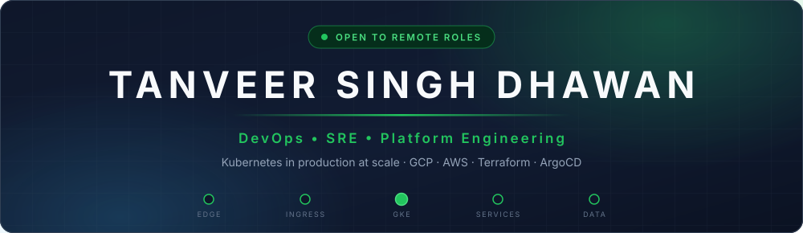
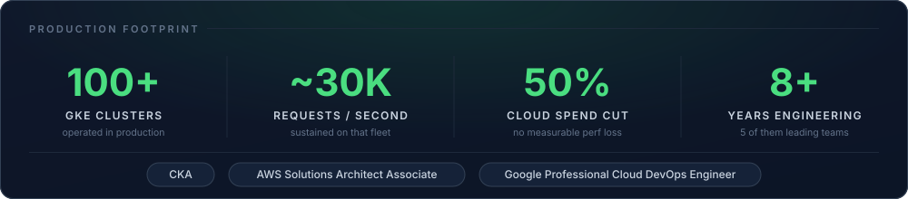
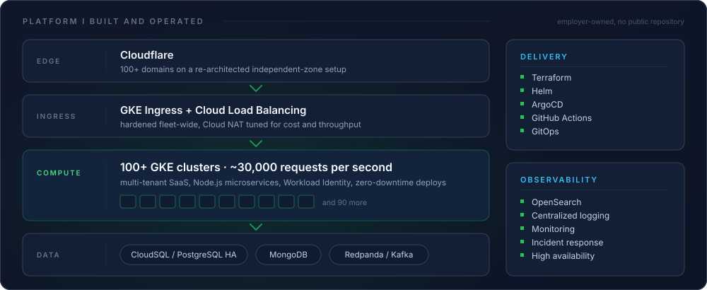

`Kubernetes` • `GKE` • `Terraform` • `ArgoCD` • `GCP` • `AWS` • `SRE` • `Platform Engineering`

---

## 👋 About me

I run Kubernetes in production at scale. The last system I owned was a multi-tenant SaaS platform spread across 100+ GKE clusters, serving roughly 30,000 requests per second in a regulated market, and I cut its cloud bill in half without losing reliability.

Eight years in backend and platform engineering, five of them leading teams. I started out writing Node.js and PostgreSQL services and moved into platform work later, so I know how the applications I keep alive actually behave under load. That is usually where pure-ops engineers run out of road.

I hold the CKA, AWS Solutions Architect Associate, and Google Professional Cloud DevOps Engineer certifications. I have worked remote-first across time zones for years and I am comfortable joining a team anywhere.

---

## 📈 By the numbers

---

## 🛠 How I work

- **I measure before I optimize.** The 50% cloud saving came out of Cloud NAT tuning and right-sizing GKE workloads, not out of switching things off.
- **I read the service code.** I wrote Node.js and PostgreSQL systems for years before I ran the platform underneath them, so I can debug the application and the cluster in the same session.
- **I automate the repetitive parts.** Standardizing Kubernetes-on-GCP delivery across 100+ client projects took most of the manual work out of releases.
- **Security work covers the whole fleet or it does not count.** The Workload Identity rollout and Ingress hardening went to all 100+ clusters, not a pilot group.

---

## ⚡ Tech stack

### ☁️ Cloud and networking

### ☸️ Kubernetes and platform

### 🧱 Infrastructure as code and CI/CD

### 🧑‍💻 Backend

### 🗄 Data and observability

---

## 🏗 Production systems

### Platform and SRE

| Work | Scale | Stack |
|------|-------|-------|
| Multi-tenant SaaS platform | 100+ client environments, ~30,000 RPS | GKE, ArgoCD, Terraform, Helm |
| Cloud cost reduction | ~50% spend cut, no measurable performance loss | Cloud NAT, GKE right-sizing, Cloudflare |
| Fleet security hardening | all 100+ clusters | Workload Identity, GKE Ingress, Cloud Load Balancing |
| Centralized logging migration | all 100+ clusters | OpenSearch |
| Cloudflare zone re-architecture | 100+ domains | Cloudflare independent zones |

### Backend and delivery

| Work | Scale | Stack |
|------|-------|-------|
| Gaming platform backend | millions of transactions a day | Node.js, PostgreSQL, MongoDB |
| Delivery pipeline standardization | 100+ client projects | Kubernetes on GCP, CI/CD |
| Investment and financial services platform | production backend, 2019 to 2022 | Node.js, TypeScript, Python, Vue.js |
| Technical debt reduction | 40% reduction, faster databases | coding standards, security protocols, architecture review |

> These are systems I built and ran in professional roles. The code belongs to my employers, so there is nothing to link to here. I am happy to walk through any of them in an interview.

---

## 🧭 Experience

| Period | Role | Company | Location |
|--------|------|---------|----------|
| Jan 2025 - Jan 2026 | Technical Lead | Computer Science Lab | Vientiane, Laos |
| Apr 2022 - Dec 2024 | Backend Team Lead | Computer Science Lab | Vientiane, Laos |
| Apr 2021 - Mar 2022 | Backend Team Lead | TNK Investment Consultant Sole | Vientiane, Laos |
| Nov 2019 - Apr 2021 | Software Engineer | TNK Investment Consultant Sole | Vientiane, Laos |
| Jul 2017 - Aug 2019 | Software Developer | Apptroid Technology | Mumbai, India |

B.Tech in Computer Science and Engineering, Krishna Institute of Engineering and Technology, Dr. APJ Abdul Kalam University, 2014 to 2018.

---

## 🎓 Certifications

---

## 🧠 What I am focused on

<table>
  <tr>
    <td>Platform engineering</td>
    <td>Multi-cluster Kubernetes</td>
    <td>GitOps delivery</td>
  </tr>
  <tr>
    <td>Cloud cost optimization</td>
    <td>Observability</td>
    <td>Zero-downtime releases</td>
  </tr>
  <tr>
    <td>Terraform at scale</td>
    <td>Event-driven architecture</td>
    <td>PostgreSQL high availability</td>
  </tr>
  <tr>
    <td>Cloud security posture</td>
    <td>Incident response</td>
    <td>Multi-tenant SaaS</td>
  </tr>
</table>

---

## 📊 GitHub

Most of my work sits in private repositories, so public commit counts undersell it. The figures below are generated daily by an Action running inside this repository and they include private repositories, which is where the last eight years actually live.

---

## 📬 Contact

